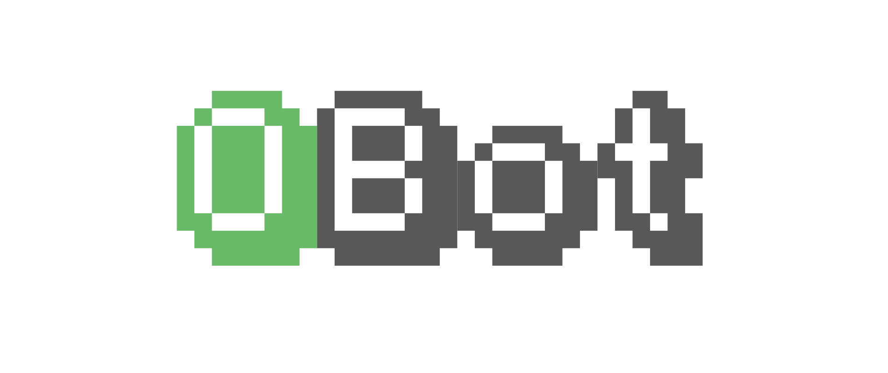

# OBot
:bell: Facebook Messenger Bot

Bot developed in **node.js** and `express` the minimalist web framework.
OBot's work is to help users to make a trip with sharing bikes. He can advise users while they want to pick up a bike or when they want to drop a bike off.



## Developpement

### Docker

```sh
docker-compose up -d
docker exec -it obot_server_1 bash
```
and then :
```sh
DEBUG='obot.*' node app/index.js | ./node_modules/.bin/bunyan
```

### `ngrok`

Add this line to your local `/etc/hosts` : `<docker machine IP address>  docker-env`.  
For example, you get :

```
cat /etc/hosts
##
# Host Database
#
# localhost is used to configure the loopback interface
# when the system is booting.  Do not change this entry.
##
127.0.0.1	localhost
255.255.255.255	broadcasthost
::1             localhost
192.168.99.100  docker-env
```

Then you can do :
```sh
ngrok http docker-env:3000
```

`ngrok` will redirect your docker localhost to an `HTTPS` url needed to setup webhook.

## Running Docker container in production

Build container :
```sh
docker build --rm -t obot/dev -f Dockerfile .
```

Run container :
```sh
docker run -i -t obot/dev
```